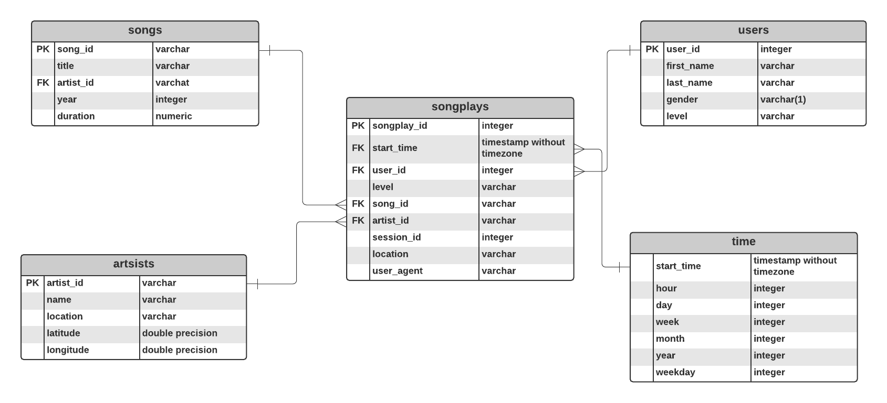

# Sparkify Data Lake
## Introduction
A music streaming startup, Sparkify, wants to analyze the [data](http://millionsongdataset.com/) they've been collecting on songs and user activity on their new music streaming app. They have grown their user base and song database and want to move their data warehouse to a data lake. Their data - a directory of JSON logs on user activity on the app, as well as a directory with JSON metadata on the songs in their app - resides in S3.
## Project Objective
Build an ETL pipeline that extracts their data from S3, processes it with Spark, and loads it back into S3 as a set of dimensional tables for their analytics team to continue finding insights in what songs their users are listening to. This Spark process will be on a cluster in AWS.
## Contents
1. etl.py: Python file with functions to run ETL processing using PySpark
2. dl.cfg: Configuration file which holds AWS credentials
3. requirements.txt: List of Python packages required to complete the ETL
4. Data Lake Schema 
5. README.md
## Schema

## Prerequisites
1. Python 3.6.x or newer
2. AWS cliv2 (https://docs.aws.amazon.com/cli/latest/userguide/getting-started-install.html), SSH, and less
4. An active AWS EMR Cluster in us-west-2 with 5 instances
5. An active S3 bucket in us-west-2
6. Private key file (in your workspace)
## How to Run
1. Add AWS credentials to dl.cfg (with quotes)
2. Add bucket name to output_data on line 188 in etl.py
3. Ensure you can connect to your EMR cluster
```
ssh -i <path to private key file> hadoop@<master node host>
```
4. Once connected, type `logout`
5. In your root directory, 
* copy `<privatekey>.pem` file to hadoop
```
scp -i <path to private key file> <path to private key file> hadoop@<master node host>:/home/hadoop/
```
* copy `etl.py`, `dl.cfg`, and `requirements.txt` files to hadoop
```
scp -i <path to private key file> <file name> hadoop@<master node host>:/home/hadoop/
```
6. Reconnect to your EMR Cluster then in your Hadoop terminal,
* Install requirements using `pip install --user -r requirements.txt`
* Run `spark-submit etl.py`
